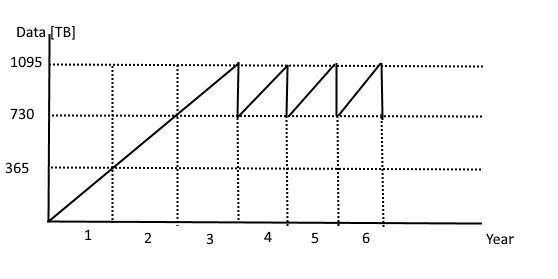
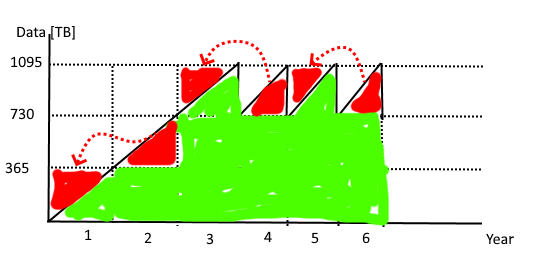
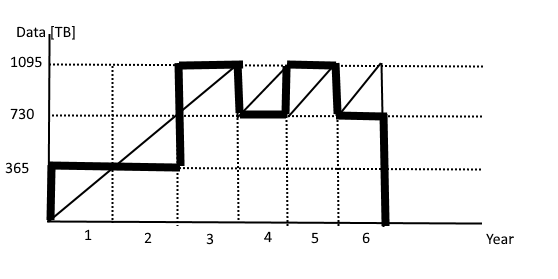

### #TYDZIEŃ5.1
#### Blobs:
* \+ Przechowywanie logów przez długi czas; opcjonalnie z włączoną opcją zapobiegającą zmianom w danych.
* \+ Zdjęcia sprzedawanych produktów.
* \- Do trzymania plików, które są modyfikowane przez wiele osób jednocześnie.

#### Files:
* \+ Udział sieciowy, na którym będą przechowywane różne dane dla partnerów firmy, dostępne dla każdego z nich.
* \+ "Lift and shift", czyli zastąpienie dotychczas używanego lokalnego udziału udziałem chmurowym.
* \- Do trzymania dysków maszyn wirtualnych.

#### Queues:
* \+ Przyjmowanie zamówień do realizacji. Przydatne zwłaszcza w okresie wzmożonego ruchu, gdy klientowi pokazujemy komunikat, że jego zamówienie zostało przyjęte, ale tak naprawdę jego obsługa jeszcze nie ruszyła, a tylko została dodana do kolejki.
* \+ Asynchroniczna komunikacja między systemem magazynowym a frontendem.
* \- Do komunikacji między komponentami systemu, które wymagają synchroniczności i gwarancji przetwarzania danych w określonej kolejności.

#### Tables:
* \+ Do przechowywania danych, które wymagają elastycznego schematu, np. katalog sprzedawanych produktów.
* \+ Do przechowywania danych, które nie wymagają skomplikowanych złączeń lub relacji.
* \- Gdy wymagamy relacyjności w danych, np. przechowywanie transakcji sprzedażowych powiązanych z konkretnym klientem i produktem.

### #TYDZIEŃ5.2
* \+ Gdy chcemy mieć file server, który pozwoli nam trzymać spore ilości danych, w tym te często używane - lokalnie, a te rzadziej - w chmurze. Ponadto chcemy, aby dane się samoistnie przenosiły z lokalnego StorSimple'a do chmury i odwrotnie.
* \- Gdy mamy bardzo dużo danych, których nieustannie używamy i które nie mieszczą się na StorSimple. W takim przypadku dane by nieustannie wędrowały między StoreSimplem a chmurą, co by mogło wygenerować spore koszty i nie było zbyt przydatne.

### #TYDZIEŃ5.3
To po kolei:
1. Do przechowywania danych używamy Azure Storage Account (North Europe, Block Blob Storage, Standard performance tier, General Purpose V2, LRS, Archive access tier).
2. Przez pierwsze trzy lata codziennie przybywa nam 1 TB danych, czyli po pierwszym roku mamy 365 TB, po drugim 730 TB, a po trzecim 1095 TB.
3. Na początku czwartego roku usuwamy dane z pierwszego roku, czyli wracamy do poziomu 730 TB i codziennie dochodzi nam 1 TB - aż do 1095 TB na koniec roku i potem znowu spada do 730 TB.
4. Do kosztów nie wliczam mechanizmu robienia backupów, a tylko koszt przechowywania danych.
5. Wykres pokazujący ilość przechowywanych danych jest pokazany na poniższym obrazku. To, co nas interesuje, to pole pod krzywą.

6. Na wykresie są "zęby", ale można łatwo się ich pozbyć, bo wiemy, że dane przyrastają nam codziennie w takim samym tempie. Co więcej, nie interesuje nas narastający koszt, ale całkowity, więc te "zęby" można przenieść.

7. W rezultacie dostajemy prostą figurę z dwunastoma kwadracikami, z których każdy reprezentuje przechowywanie 365 TB danych przez rok.

8. Z kalkulatora Azure wychodzi, że roczny koszt trzymania 365 TB to 4440 USD, czyli całkowity koszty to 12 * 4440 USD = 53280 USD.

