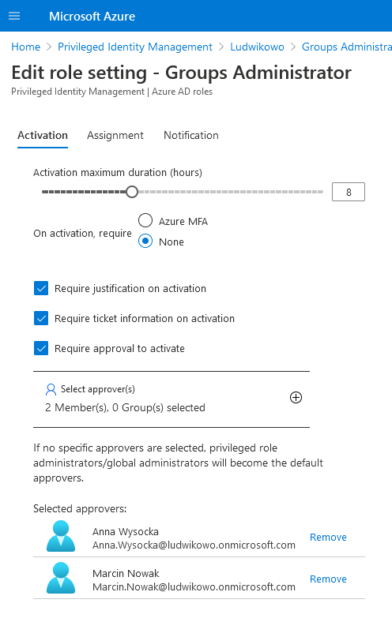
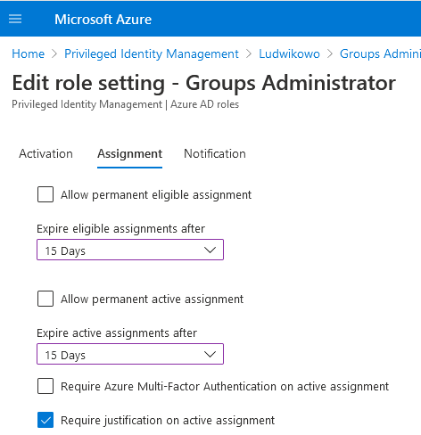
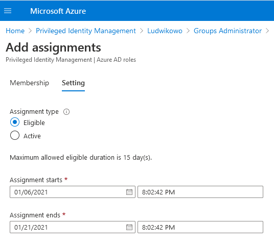

### TYDZIEŃ7.1
Zadanie rozwiązałem poprzez utworzenie dynamicznej grupy w AADl, której członkostwo bazuje na departamencie. Przykładowy użytkownik:

Grupa:

Początkowo nie mogłem utworzyć dynamicznej grupy w AAD - chodziło o to, że żaden z moich użytkowników nie miał przypisanej licencji P1. Przy jej przypisywaniu okazało się, że użytkownik musi mieć wypełnione pole "Usage location", bo inaczej licencji nie da się przypisać.

### TYDZIEŃ7.2
W AAD zarejestrowałem aplikację MySuperApp i podczas jej rejestracji został utworzony service principal, któremu można nadawać uprawnienia w różnych miejscach Azure'a poprzez przypisywanie ról (tak jak zwykłym użytkownikom).
Do uwierzytelnianie mojego service principala będzie potrzebny tenant ID, application ID oraz client secret lub certyfikat. Skorzystałem z prostszego podejścia (client secret) i jego warto by było trzymać w Key Vaulcie.

Fajne w service principalu jest to, że on jest powiązany z aplikacją i bez niej nie może istnieć.

### TYDZIEŃ7.3
Wybór najprostszej metody zależy od tego, co kto zna i lubi. Dla przykładu wyświetlenie wszystkich użytkowników za pomocą PowerShella to Get-AzureADUser.
Z kolei Graph Explorerem będzie to: https://graph.microsoft.com/v1.0/users.

### TYDZIEŃ7.4
Polisa utworzona.

### TYDZIEŃ7.5
Nie do końca jasne polecenie - "(...) oraz aby uprawniania wygasły po 15 dniach". W pierwszej chwili zrozumiałem to tak, że po aktywowaniu uprawnień, mają one działać przez 15 dni. Ale w portalu maksymalny okres aktywacji to 24h, więc autorowi polecenia pewnie chodziło o assignmnent, a nie o aktywację, czyli o czas, podczas którego użytkownik będzie miał możliwość aktywowania uprawnień.

