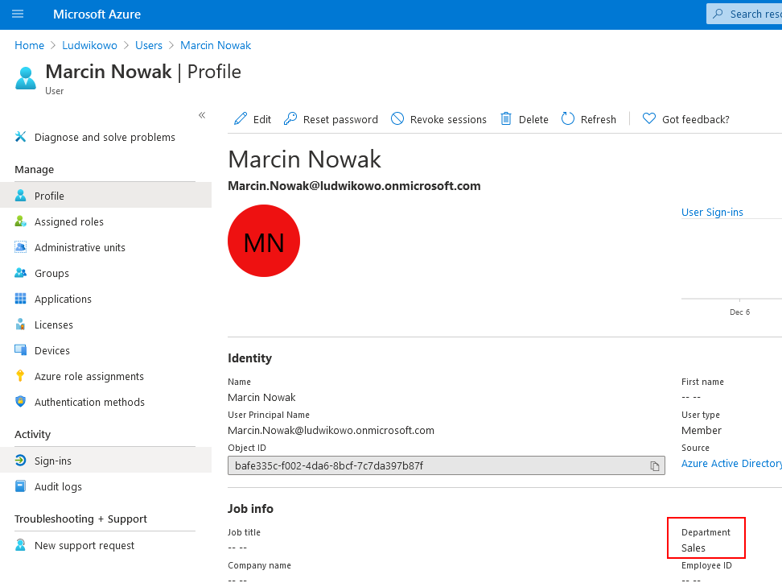
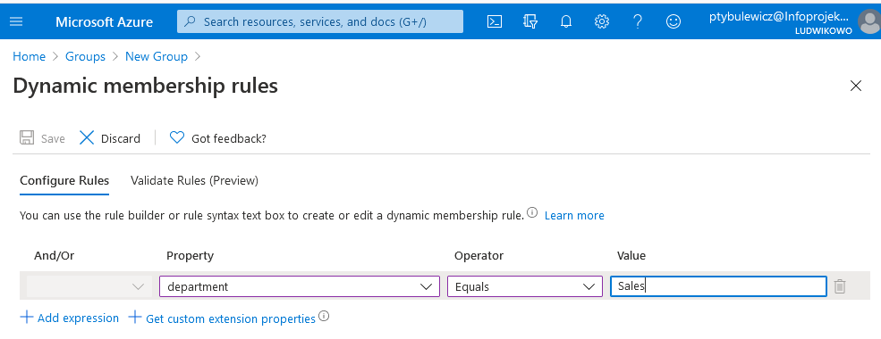
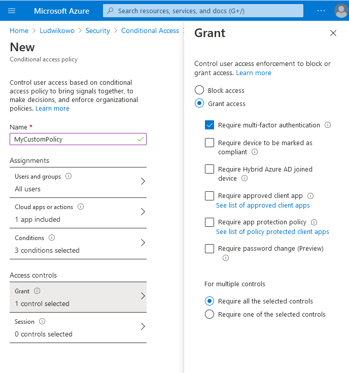
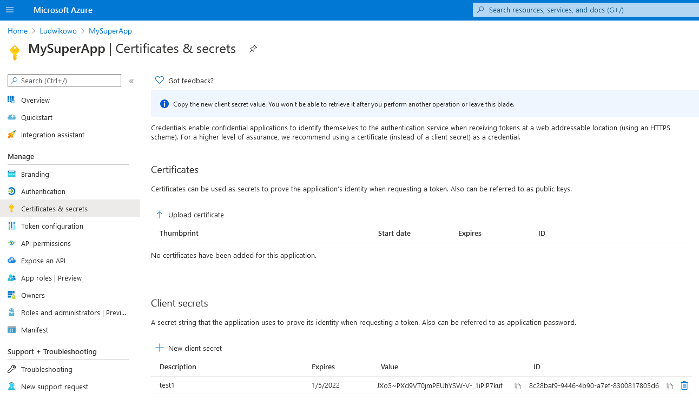

### TYDZIEŃ7.1
Zadanie rozwiązałem poprzez utworzenie dynamicznej grupy w AADl, której członkostwo bazuje na departamencie. Przykładowy użytkownik:

Grupa:

Początkowo nie mogłem utworzyć dynamicznej grupy w AAD - chodziło o to, że żaden z moich użytkowników nie miał przypisanej licencji P1. Przy jej przypisywaniu okazało się, że użytkownik musi mieć wypełnione pole "Usage location", bo inaczej licencji nie da się przypisać.

### TYDZIEŃ7.2
To zadane nie jest do końca jasne: czy chodzi o ograniczenie użytkownikom dostępu do aplikacji czy o nadanie uprawnień samej aplikacji, czyli ograniczenie jej uprawnień. Dla pewności zrobiłem oba podejścia.

W AAD zarejestrowałem aplikację MySuperApp, do której dostęp jest ustalany poprzez conditional access. W tej polisie wymusiłem MFA dla wszystkich użytkowników spoza Polski próbujących dostać się do mojej aplikacji.

Tutaj natrafiłem na kolejny zgrzyt: nie dało sie utworzyć conditional access policy, dopóki nie wyłączyłem security defaults dla całego tenanta.

Jeżeli chodzi o uprawnienia nadawane aplikacji, to podczas jej rejestracji został utworzony service principal, któremu można nadawać uprawnienia w różnych miejscach Azure'a poprzez przypisywanie ról.
Do uwierzytelnianie mojego service principala będzie potrzebny tenant ID, application ID oraz client secret lub certyfikat. Skorzystałem z prostszego podejścia (client secret) i jego warto by było trzymać w Key Vaulcie.

### TYDZIEŃ7.3
Wybór najprostszej metody zależy od tego, co kto zna i lubi. Dla przykładu wyświetlenie wszystkich użytkowników za pomocą PowerShella to Get-AzureADUser.
Z kolei Graph Explorerem będzie to: https://graph.microsoft.com/v1.0/users.