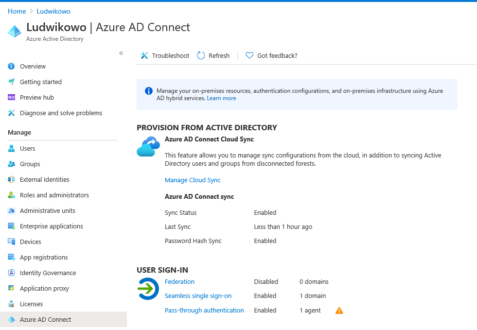
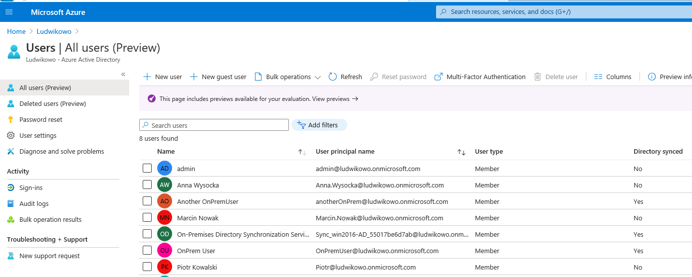
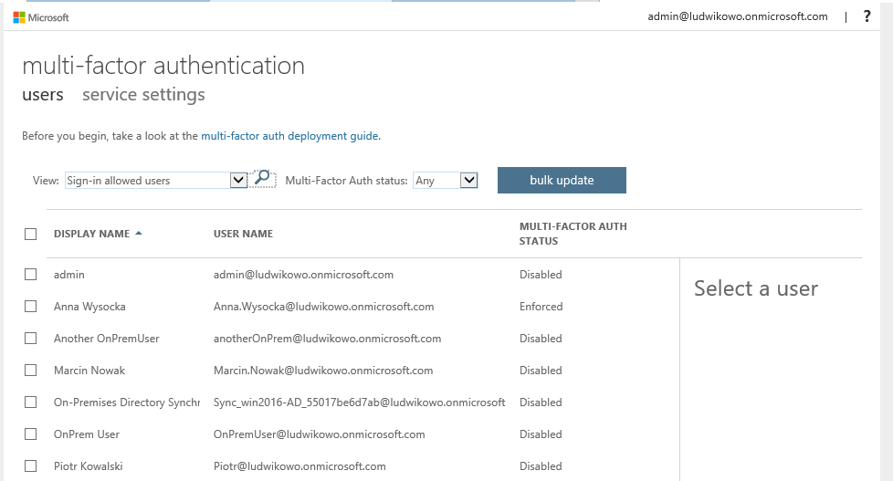
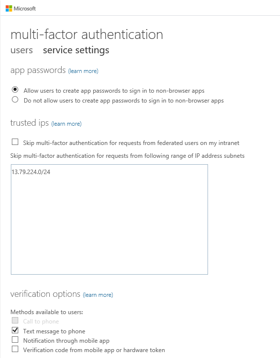

### TYDZIEŃ7.1
1. Zrobiłem od zera Vmkę w Azure, na której potem doinstalowałem kontroler domeny.
2. Zainstalowałem tam AD Connect z wymaganymi opcjami.  

3. W AD utworzyłem nowego użytkownika, który został przeniesiony do chmury.  

### TYDZIEŃ7.2
1. Włączyłem MFA wybiórczo dla jednego użytkownika poprzez AAD -> Users -> MFA. 

2. Jako metodę weryfikacji wybrałem SMSy.
3. Testowo zalogowałem się do portalu jako ten użytkownik i wtedy musiałem zarejestrować numer telefonu.
4. Wylogowałem się i zalogowałem jeszcze raz - zgodnie z oczekiwaniami dostałem SMSa.
5. Dodałem zakres zaufanych IP do MFA i zalogowałem się do portalu z VMkl wpadającej w ten zakres - tym razem logowanie nie wymagało MFA.  

6. W AAD miałem już utworzoną dynamiczną grupę i zmodyfikowałem właściwości mojego testowego użytkownika, aby się do tej grupy załapał. W zasadzie nic to nie zmieniło w kwestii MFA. Przypuszczam, że autor polecenia miał na myśli wykorzystanie Conditional Access dla dynamicznej grupy.

W MFA trochę irytujący jest ten stary portal, na którym można skonfigurować dodatkowe rzeczy; takie rozdwojenie jaźni. Bo na upartego, zakresy IP bez MFA można skonfigurować na dwa sposoby:
1. Tak, jak ja to zrobiłem.
2. Poprzez Conditional Access i Named Locations, w których się zdefiniuje odpowiednie zakresy.
