### TYDZIEŃ8
Tym razem zadanie domowe było dość pracochłonne i jego zrobienie zajęło mi kilka dni. Widzę też, że z racji przerw w jego robieniu, rozjechało mi się nazewnictwo i to tylko potwierdza, jak ważne jest ustalenie konwencji nazewnictwa na początku projektu i później trzymanie się jej.

Postanowiłem trochę rozbudować zadanie, aby przy okazji pobawić się innymi funkcjonalnościami. Nie wszystko mi do końca zagrało, ale i tak było interesująco. Moja końcowa architektura wygląda następująco: 
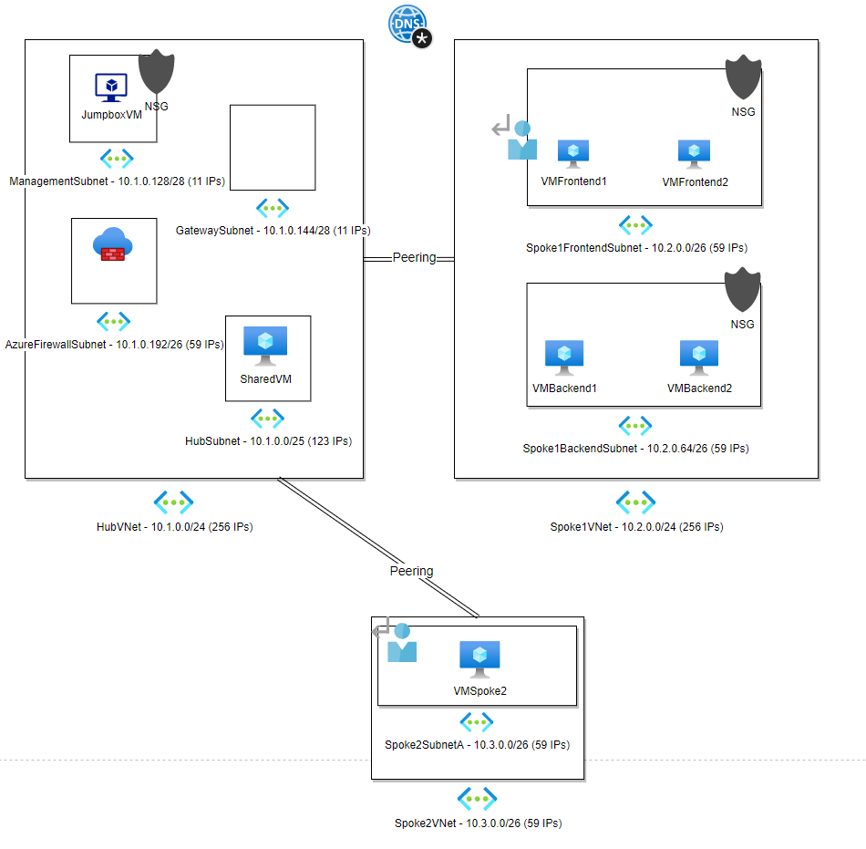

Opis:
1. To jest architektura typu hub & spoke i w moim przypadku zrobiłem dwa spoke'i, bo chciałem przetestować routowanie ruchu przez firewalla w hubie.
2. Zakresy adresów IP starałem się dobrać w taki sposób, aby niepotrzebnie nie marnować puli adresów, ale też aby ich wystarczyło do wszystkich potrzeb.
3. Cały hub znajduje się w sieci HubVNet. W jej skład wchodzą następujące podsieci:
    - HubSubnet - tutaj mają być trzymane wszystkie zasoby współdzielone przez całą sieć.
    - AzureFirewallSubnet - podsieć dla firewalla, który jest używany do filtrowania całego ruchu oraz do routowania między spoke'ami.
    - GatewaySubnet - pusta podsieć, do której kiedyś może trafić VPN Gateway łączący się z siecią on-premises. Tą podsieć zrobiłem tylko po to, aby sprawdzić, czy starczy mi adresów.
    - ManagementSubnet - podsieć dla Jumpboxa. Vmka w tej podsieci jest jedyną Vmką z publicznym IP; dostęp do wszystkich innych jest realizowany poprzez Jumpboxa.
4. Drugą siecią jest Spoke1VNet. On ma dwie podsieci:
    - Spoke1FrontEndSubnet - tutaj siedzą dwie Vmki, które udają serwery webowe. Na obrazku widać trochę wolnego miejsca i tam planowałem dodać application gateway'a, ale nic z tego nie wyszło.
    - Spoke1BackendSubnet - tuaj siedzą dwie Vmki, które udają serwery bazodanowe. Tutaj tymczasowo dodałem internal load balancera, ale potem go usunąłem, bo miałem problemy z NSG, a już nie miałem siły dociekać źródła problemów.
5. Ostatnią siecią jest Spoke2VNet, który ma tylko jedną podsieć:
    - Spoke2SubnetA - testowa sieć z jedną Vmką, która posłużyła mi do testowania routingu.
6. Zrobiłem peering między hubem a dwoma spoke'ami.
7. W sumie utworzyłem 7 Vmek i początkowo ustawiałem im zbyt duży rozmiar, przez co zabrakło mi CPU, bo dobiłem do limitu 20 CPU w regionie. W rezultacie musiałem zmniejszyć część maszynek z D4s_v3 do DS2_v2.
8. Od siebie dodałem jeszcze private DNS zone, abym mógł pingać Vmki po nazwach.
Oprócz tego dorzucilem dwie tabele routingu, aby działał ruch między spoke'ami poprzez huba (bez bezpośredniego peeringu między spoke'ami).

## Zadanie 1.
Testowane ścieżki ruchu zaznaczyłem czerwonymi strzałkami:  
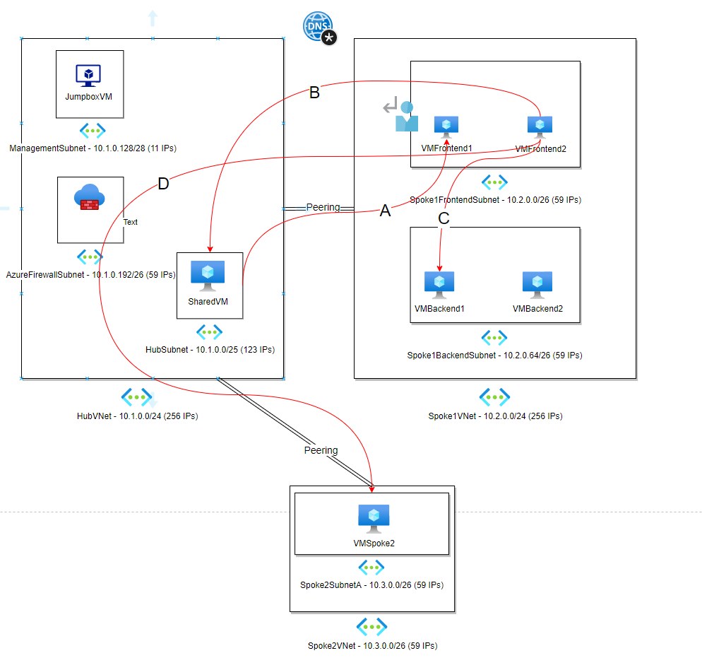

A) Test ruchu z SharedVM do VMFrontend1 (hub -> spoke1):  
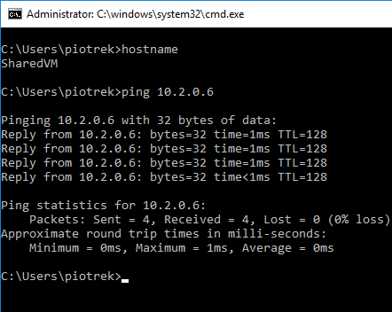

Oczywiście na dzień dobry nie mogłem pingać po nazwie maszynki (VMFrontend1), ale po dodaniu private DNS zone (ludwikowo.com) oraz podlinkowaniu tam Vnetów wszystko zagrało. 
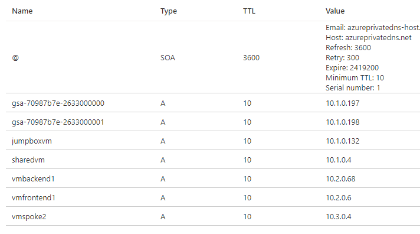   
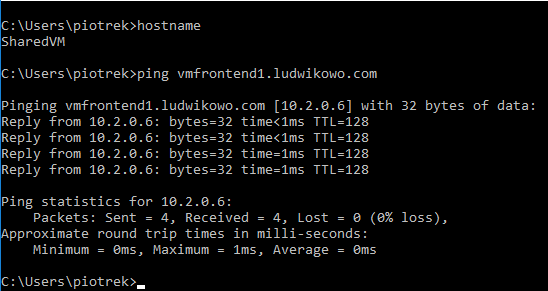  

B) Test ruchu z VMFrontend2 do SharedVM (spoke1 -> hub):  
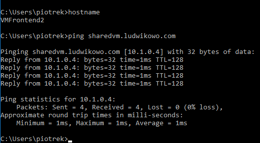 

C) Test ruchu z VMFrontend2 do VMBackend1 (spoke1 -> spoke1):  
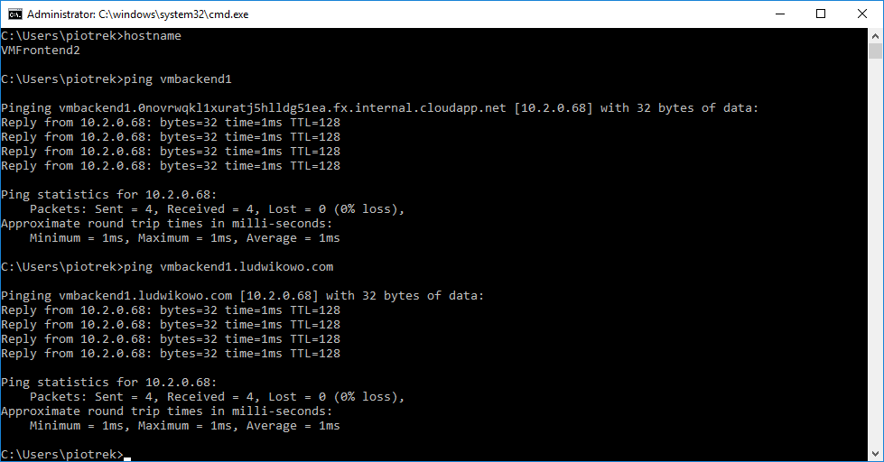 

Z racji tego, że obie maszynki są w tym samym Vnecie, to pinganie po nazwach (bez domeny) działa z pudełka.

D) Test ruchu z VMFrontend2 do VMSpoke2 (spoke1 -> spoke2 poprzez hub):
Między tymi Vnetami nie ma bezpośredniego peeringu, więc na dzień dobry ruchu też nie będzie. Ale po dodaniu route'a przez firewall w hubie wszystko zagrało. Tutaj trochę się zamotałem, bo na początku zapomniałem dodać regułę w firewallu zezwalającą na ruch.  
 
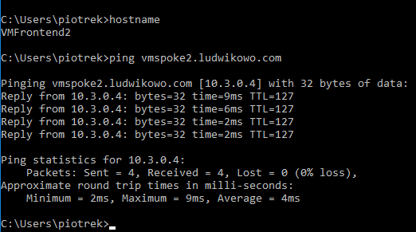 

## Zadanie 2:
Zrobiłem dwa ASG: 
  - Web-ASG - dla VMFrontend1 oraz VMFrontend2,
  - SQL-ASG - dla VMBackend1 oraz VMBackend2.

Założyłem trzy NSG:
  - dla Spoke1BackEndSubnet:  
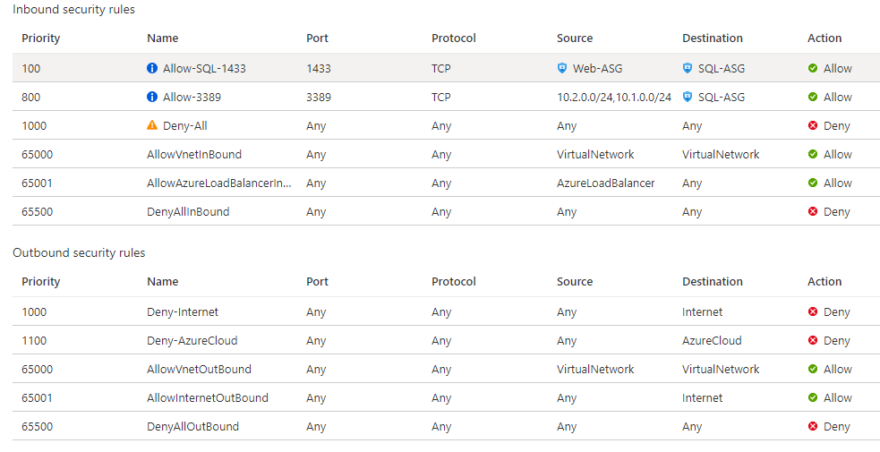 

  - dla Spoke1FrontEndSubnet: 
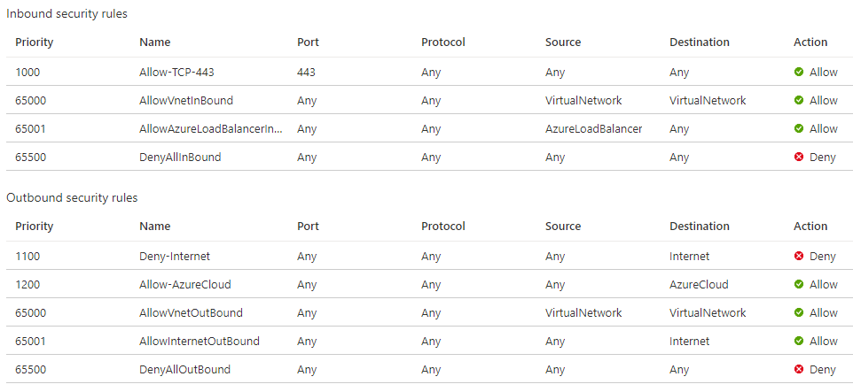 

 - dla podsieci Jumpboxa: 
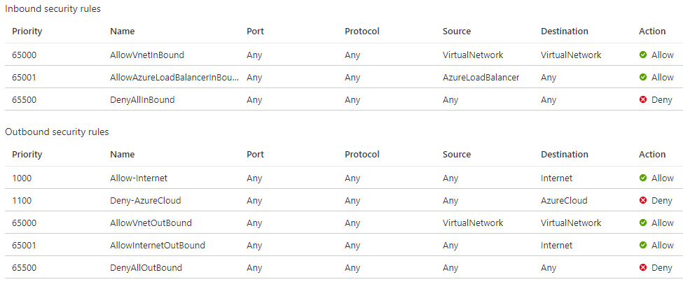 

Testy:
1. Z serwera aplikacyjnego do serwera bazodanowego po porcie 1433 (testy poprzez IP flow verify): 
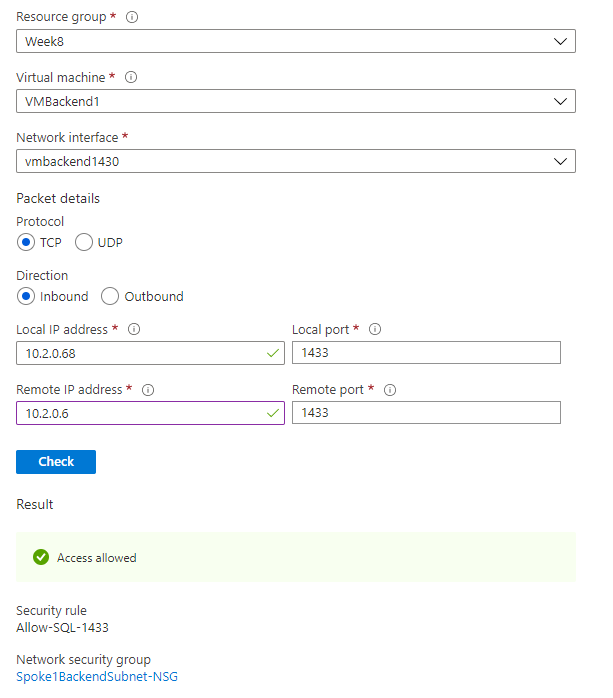 
2. Z Vmki z huba do serwera bazodanowego po porcie 3389: 
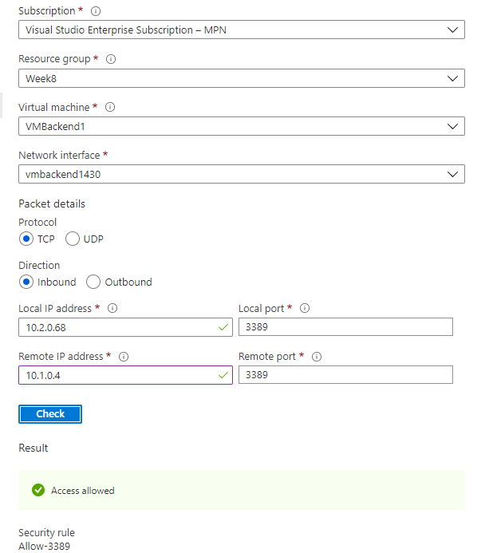 

## Zadanie 3:
Przed zebraniem danych usunąłem firewalla aby zmniejszyć koszty. Z tego samego powodu ruch zbierałem tylko przez kilka godzin, ale i tak trafiło mi się trochę strzałów rozpoznanych jako malicious (wszystkie waliły do Jumpboxa, bo to jedyna Vmka wystawiona na świat): 
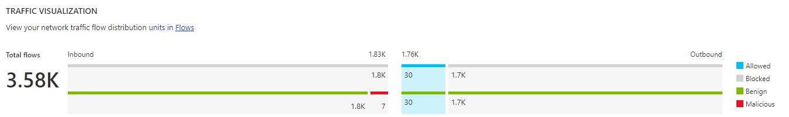  

Okazało się, że to USA mnie atakuje:  
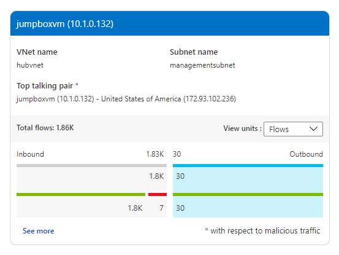  

Ale najwięcej zablokowanego ruchu szło z Bułgarii:  
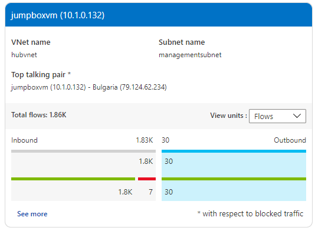  

Żaden ze spoke'ów nie odnotował ruchu przychodzącego, bo nie ma tam w ogóle dostępu ze świata, a ja sam nic już potem nie robiłem:  
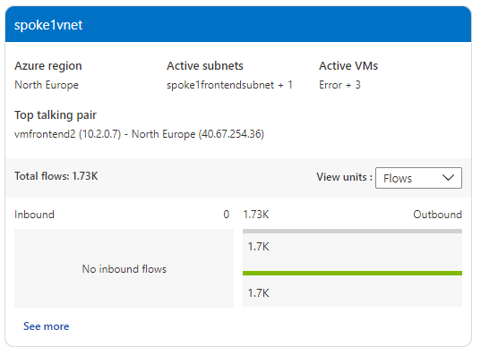  

## Końcowe uwagi:
1. To była najciekawsza laborka do tej pory.
2. Temat sieci jest bardzo rozbudowany i jest tutaj jeszcze sporo rzeczy, których w labie nie dotknąłem. Przykładowo - konfiguracja SQL Servera w Always On availability group jako IaaS za internal load balancerem.
3. Już się nie mogę doczekać laborki z sieci na AZ-304.
